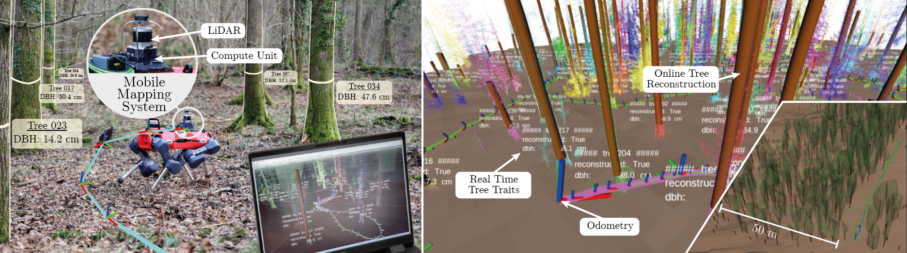

# Real Time Trees

Author: [Leonard Freißmuth](https://ori.ox.ac.uk/people/leonard-freissmuth/)


## Introduction

This repository contains a **pipeline for reconstructing trees** and extract corresponding tree traits online by attaching it to a SLAM pipeline. More information about this can be found on the [Digiforest webpage](https://digiforest.eu/news/2022-08-19-realtime-forest-inventory) and [this publication](https://arxiv.org/pdf/2403.17622).



This repository is structured as follows:

- `realtime_trees`: The ROS 2-independent Python modules for reconstructing trees from point clouds
- `realtime_trees_msgs`: The ROS 2 message definitions
- `realtime_trees_ros`: ROS 2 wrapper for `realtime_trees`

## Setup

The following section describes how the code inside this repository can be set-up and run. You can either install all of the dependencies on your system and run the code locally or use the provided Docker file.

### Docker

Browse the `docker` folder and set the desired user id and username inside the environment file `.env`. Then build the image and run the container with the following instructions:

```sh
cd realtime-trees/docker
docker compose -f docker-compose.yaml build
docker compose -f docker-compose.yaml up
```

Additionally you might use the [Visual Studio Code Devcontainers extension](https://code.visualstudio.com/docs/devcontainers/containers) as described [here](https://github.com/2b-t/docker-for-robotics/blob/main/doc/VisualStudioCodeSetup.md). It is in particular useful as it [supports Git out of the box](https://code.visualstudio.com/remote/advancedcontainers/sharing-git-credentials).

Once up and running, you can find the container id with `docker ps` and enter the container with `docker exec -it ##### bash`. 
In the conatainer, the workspace is already built and you can launch the nodes as described in the next section.

### Local

Alternatively you can run the code locally. First of all clone the repository into your `ament_ws/src` folder:

```sh
cd ament_ws/src
git clone git@github.com:ori-drs/realtime_trees.git
cd realtime_trees
```

Then setup the **Python 3 virtual environment**, inheriting system dependencies:

```sh
python3 -m venv realtime_trees_ros/env --system-site-packages
source realtime_trees_ros/env/bin/activate
```

Install the system dependencies by doing

```sh
pip3 install -r realtime_trees/requirements.txt
```

Then, with the environment activated, build the workspace using `colcon`:

```sh
cd ../ament_ws
colcon build
source install/setup.bash
```

## Running

The following section explains how the package can be run with ROS 2.

### ROS 2
For launching the pipeline, source the ros2 workspace and run the following command:

```sh
ros2 launch realtime_trees_ros realtime_trees.launch.py
```


### Attaching Realtime Trees to your ROS-based SLAM or Odometry Pipeline

In case your realtime pipeline does not support local mapping, we have provided a payload accumulation node generating payload point clouds. In the launch file, several argumends need to be configured (bold) according to your odometry and/ or SLAM pipeline others can remain at the defaults:

- **odometry_topic**: Topic name for odometry input, which transforms from odom frame to sensor frame
- **pointcloud_topic**: Topic name for point cloud input (must be in map frame)
- **sensor_frame_id**: Frame ID of the sensor (point cloud frame)
- **odom_frame_id**: Frame ID of the odometry (odom frame)
- **map_frame_id**: Frame ID of the map (global frame)
- posegraph_topic: If this topic is specified (i.e. != ""), the payload accumulator publishes a dummy pose graph, which consists both of the odometry poses at a regular interval (`posegraph_interval`) and the odometry poses at the time stamps of an accumulated payload cloud
- posegraph_interval: Interval in seconds for odometry messages to be added to the posegraph.
- accumulation_type: "distance", "time", or "both". If "both" is chosen whichever criterion triggers first is used
- accumulation_distance: Distance threshold for accumulation (if accumulation_type is "distance")
- accumulation_time: Time threshold for accumulation in seconds (if accumulation_type is "time")
- voxel_downsample_res: Voxel downsample resolution in meters (0.0 to disable downsampling)

We have provided an example `payload_accumulator_treescope.launch.py`, with which you can test RealtimeTrees on the [Treescope Dataset](https://treescope.org/)'s processed rosbags (e.g. [VAT-0723/processed](https://tnl.treescope.org/Treescope/Treescope_v1.0_DIST/VAT-0723/processed/)), which under the topics `/Odometry` and `/cloud_registered_body` provide odometry and point clouds in sensor aka body frame.

To run the example, download the bagfiles, [convert them to ROS2 bags](https://gitlab.com/ternaris/rosbags), and in four windows that have sourced the workspace's `install/setup.bash`, launch:
- `ros2 launch realtime_trees_ros realtime_trees_treescope.launch.py`
- `ros2 launch realtime_trees_ros payload_accumulator_treescope.launch.py`
- `ros2 launch realtime_trees_ros view_rviz.launch.py`
- `ros2 bag play VAT-0723U-AUTO-01`

### Offline with SLAM output

Open the notebook `realtime_trees/notebooks/offline_from_g2o.ipynb` and update the path to the folder containing the `*g2o` files and the sub-directories with the individual point clouds. Now, the clouds can be loaded as if they were collected in real time and the sequence can be analyzed in post-processing.

### Offline from a single PCD Pointcloud

If you have a monolithic cloud, you can still use the tree manager from this repo to cluster and reconstruct the trees. Open, configure, and run the notebook `realtime_trees/notebooks/offline_from_pcd.ipynb`.
>**⚠️WARNING**: \
Keep in mind that a monolithic point cloud removes all temporal information of the aggregation! So any drift or misalignments present in the point cloud will deteriorate the detection and fitting result.